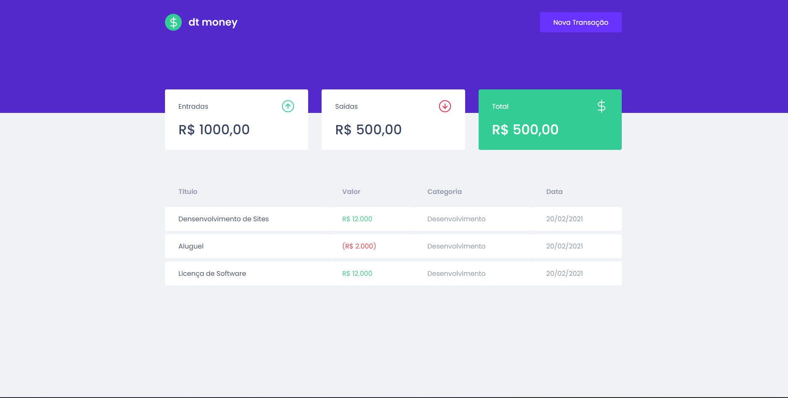

<p align="center">
  <h3 align="center">Orçamento Pessoal</h3>
</p>

<p align="center">  
  <a href="#-projeto">Projeto</a>&nbsp;&nbsp;&nbsp;|&nbsp;&nbsp;&nbsp;  
  <a href="#-tecnologias">Tecnologias</a>&nbsp;&nbsp;&nbsp;|&nbsp;&nbsp;&nbsp;
  <a href="#-getting-started">Getting started</a>&nbsp;&nbsp;&nbsp;|&nbsp;&nbsp;&nbsp;  
  <a href="#-license">License</a>
</p>

<p align="center">

  <a href="#">
    
  </a>

  <a href="#">
    
  </a>

  <a href="#">
      
  </a>

  <a href="#">
    
  </a>

  <a href="./LICENSE">
    
  </a>

</p>

<p align="center">
    
</p>

<hr>


## 💻 Projeto

Nesse projeto você vai ter um mini sistema de orçamento pessoal com ReactJS.

- Será possivel importar seu orçamento a partir de uma planilha em excel.
- Você poderá inserir dados manuais.
- Todas as informaçoes vão ficar salvas enquanto o projeto está em execução. (Não tem um banco de dados)


## 🔖 Tecnologias

Esse projeto está utilizando as seguintes tecnologias

- [React](https://reactjs.org)
- [TypeScript](https://www.typescriptlang.org/)
- [StyledComponets](https://styled-components.com)
- [MirageJs](https://miragejs.com)

## 🚀 Getting started

Clone the project

```bash
$ git clone https://github.com/nettoveloso/react-orcamento-pessoal.git
```

Access the folder
```bash
$ cd react-orcamento-pessoal
```

Follow the steps below
```bash
# Install the dependencies
$ yarn

# Start the server (backend)
$ yarn server

# Start the web (frontend)
$ yarn dev
```


## 📝 License

This project is licensed under the MIT License. See the [LICENSE](LICENSE) file for details.
